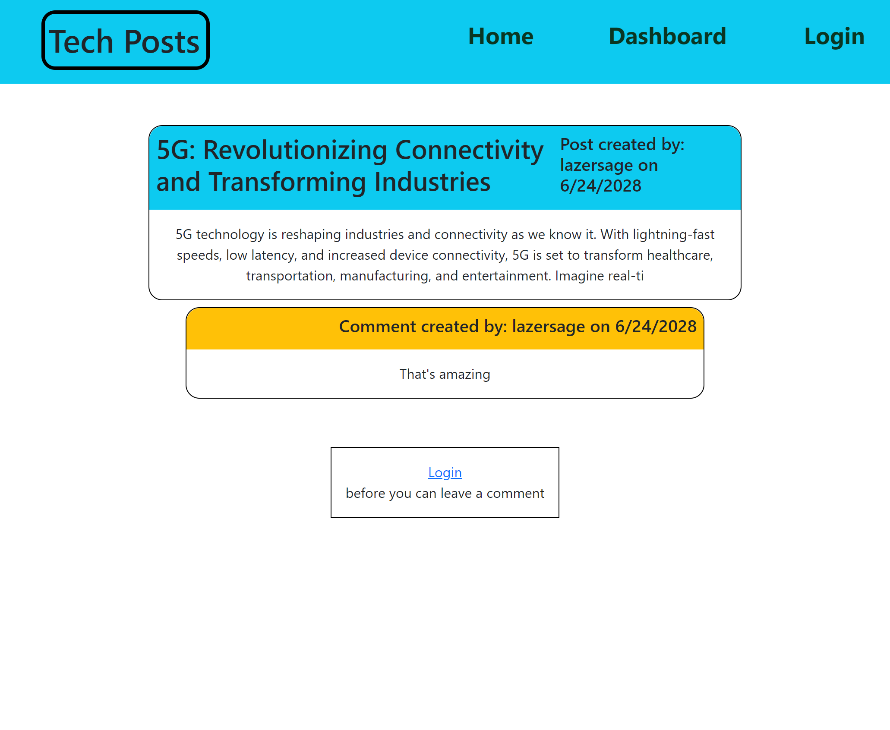
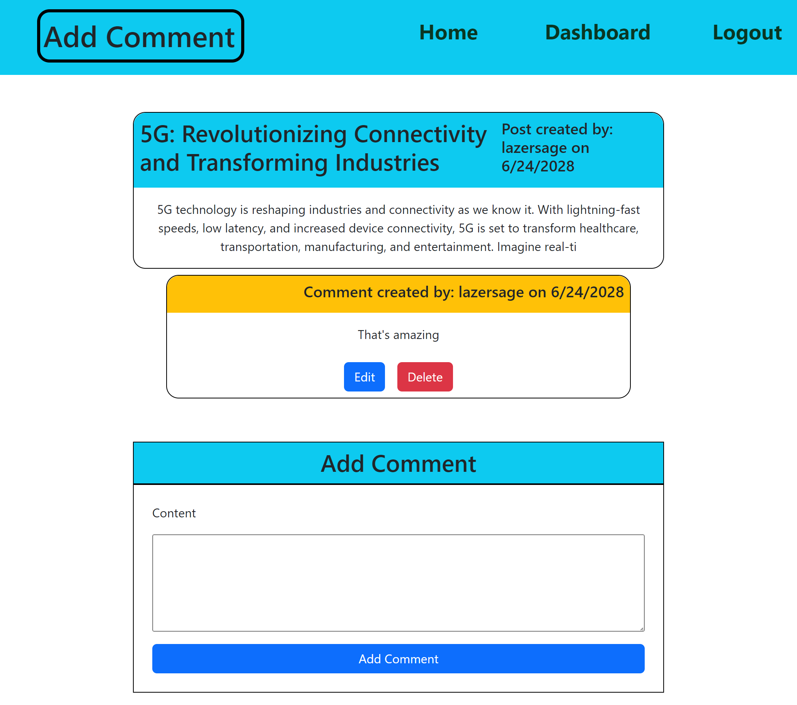
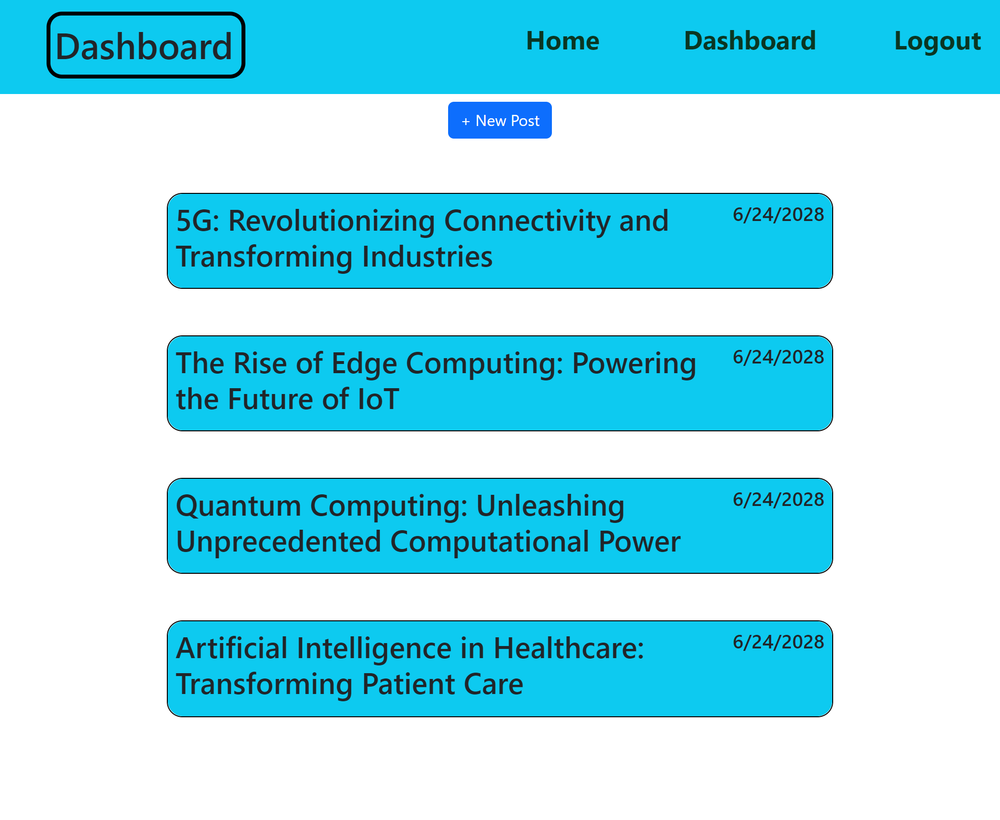
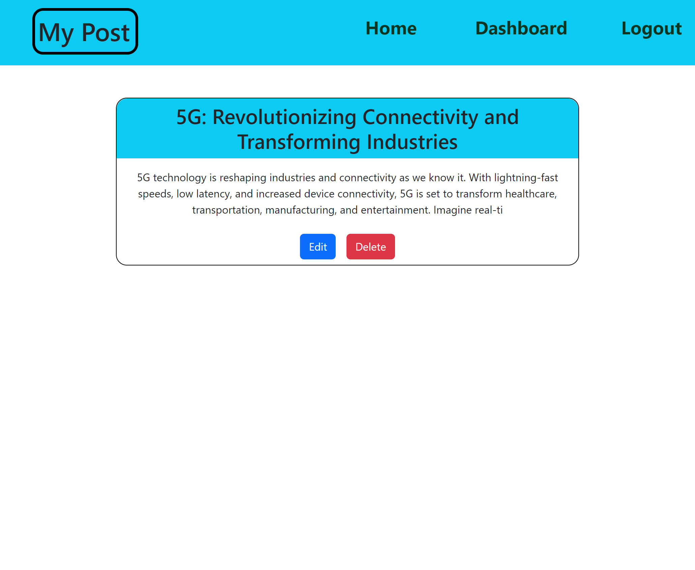
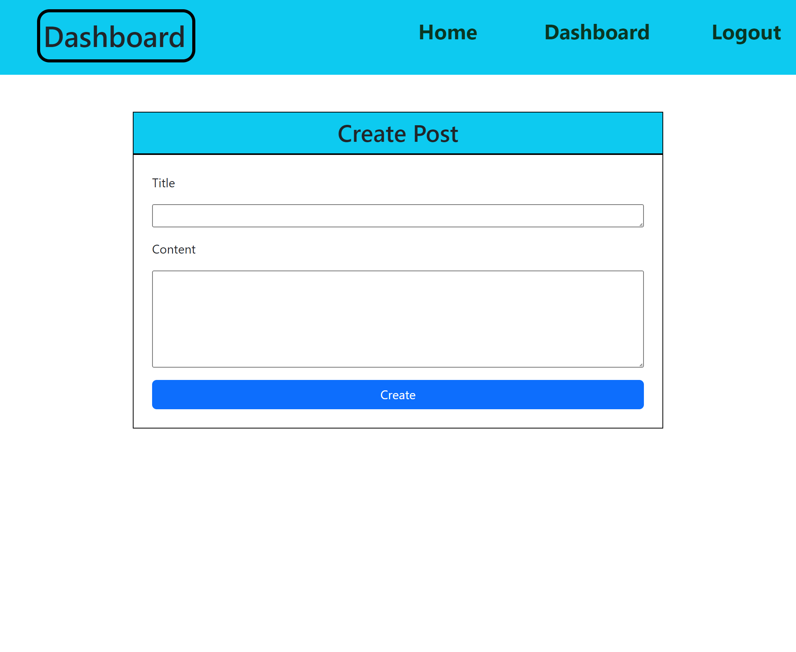

# Tech-Blog

## Description

This project was made so that I can practice with MVC (Model-View-Controller). This project taught me how to set up MVC files and how to render the views using handlebars.
Front end js communicates with the servers and retreived data from the Database using sequalized.

## Usage

This webpage is used to post tech-blogs. On the landing page you will see all existing posts.

Clicking on the post will open up the post and the comments on the post

After logging in you will be able to add a comment to the post

Clicking on the dashboard will load all the posts created by the user

Clicking on a post on your dashboard will open the post and give you the option to edit the post or delete the post

On the dashboard this is also a "+ New Post" button which will bring up a form to fill out, to post a new blog post

Live Deployed URL: https://boiling-falls-27749-5f19ea8ff128.herokuapp.com  
GitHub Repo: https://github.com/TimeBytes/Tech-Blog/

## Credits

None

## License

MIT License
